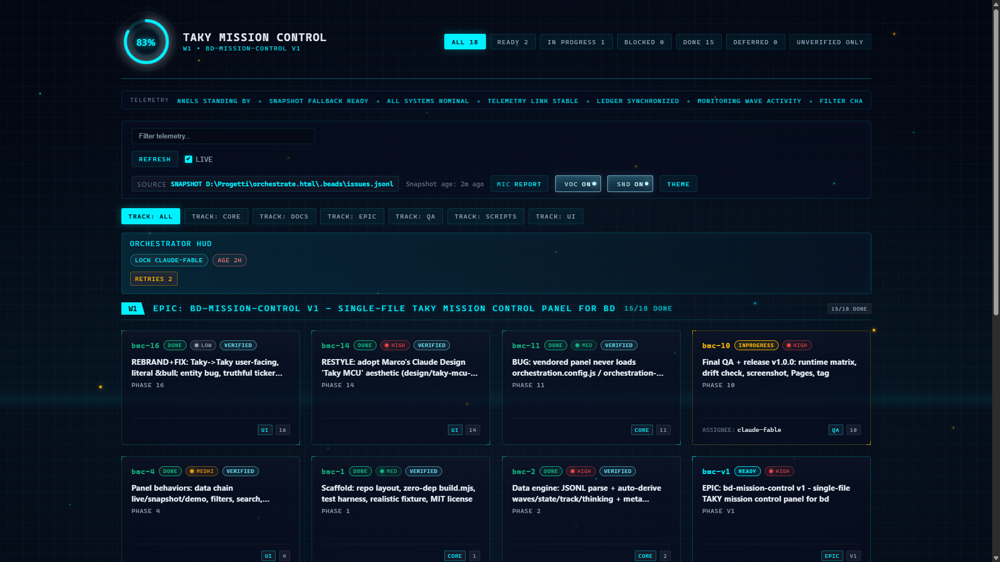

# bd-mission-control

`bd-mission-control` is a single-file mission control panel for Beads (`bd`): drop one HTML file into a project, point it at `issues.jsonl`, and get a live HUD for waves, blockers, verification drift, and orchestration telemetry. See the [live demo](https://maisdesign.github.io/bd-mission-control/) and the screenshot placeholder below.



## Quickstart

The panel auto-loads two optional sibling files when they exist:

- `orchestration.config.js`
- `orchestration-data.js`

Those files are loaded before the inline panel runtime. In a wired project, the panel then tries to fetch `../.beads/issues.jsonl` by default. When that fetch fails, it falls back to `window.BMC_SNAPSHOT` from `orchestration-data.js`. If neither is available, it shows the built-in demo dataset.

### Path A: vendor one file, add a tiny config, optionally generate a snapshot

PowerShell:

```powershell
iwr https://raw.githubusercontent.com/maisdesign/bd-mission-control/main/dist/orchestration.html -OutFile docs/orchestration.html
@'
window.BMC_CONFIG = {
  title: "your-project mission control",
  dataPath: "../.beads/issues.jsonl"
};
'@ | Set-Content -Encoding utf8 docs/orchestration.config.js
```

POSIX shell:

```sh
curl -fsSL https://raw.githubusercontent.com/maisdesign/bd-mission-control/main/dist/orchestration.html -o docs/orchestration.html
cat > docs/orchestration.config.js <<'EOF'
window.BMC_CONFIG = {
  title: "your-project mission control",
  dataPath: "../.beads/issues.jsonl"
};
EOF
```

If you plan to open the panel via `file://`, generate a sibling snapshot first:

```powershell
powershell -NoProfile -File scripts/refresh.ps1 -Out docs/orchestration-data.js
```

```sh
sh scripts/refresh.sh --out docs/orchestration-data.js
```

### Path B: clone and let the install scripts wire it

```powershell
git clone https://github.com/maisdesign/bd-mission-control.git
powershell -NoProfile -File bd-mission-control/scripts/install.ps1 -Target C:\path\to\your-project
```

```sh
git clone https://github.com/maisdesign/bd-mission-control.git
sh bd-mission-control/scripts/install.sh -Target /path/to/your-project
```

Real install behavior, verified against `scripts/install.ps1` and `scripts/install.sh`:

- `-Target` is required.
- `-Dir` changes the vendored panel subdirectory and defaults to `docs`.
- `-Update` replaces `orchestration.html`, `scripts/refresh.ps1`, and `scripts/refresh.sh`.
- `-Force` also replaces locally modified vendored files, with a loud warning.
- `orchestration.config.js` is created only if missing and preserved on reruns.
- `orchestration.meta.json` is optional and left untouched if you create one.

## Data Flow

The runtime follows one honest chain:

1. Live mode: fetch `BMC_CONFIG.dataPath`, default `../.beads/issues.jsonl`.
2. Snapshot mode: if live fetch fails and `window.BMC_SNAPSHOT` exists, read `orchestration-data.js`.
3. Demo mode: if neither source is available, show the built-in sample issues.

That means:

- Over HTTP, the default experience is live fetch from `../.beads/issues.jsonl`.
- Over `file://`, browsers usually block fetches to sibling files, so blank/live-less panels are expected unless you first run a refresh script.
- `scripts/refresh.ps1` and `scripts/refresh.sh` generate `orchestration-data.js`, which makes the same vendored panel usable from `file://`.

Refresh behavior, verified against both scripts:

- PowerShell args: `-BeadsDir`, `-Out`, `-NoBdEnrich`
- POSIX args: `--beads-dir`, `--out`, `--no-bd-enrich`
- Default output is `./orchestration-data.js`
- By default, refresh tries to enrich the snapshot with selected `bd remember` telemetry; `--no-bd-enrich` or `-NoBdEnrich` disables that

## Config

`window.BMC_CONFIG` is intentionally small. These are the only keys read by `src/panel.js`.

| Key | Type | Default | What it does |
| --- | --- | --- | --- |
| `title` | string | `""` | Replaces the document title and the i18n `title` string when provided |
| `accent` | string | `""` | Sets the `--bmc-accent` CSS variable; hex colors are also expanded into `--bmc-accent-rgb` |
| `dataPath` | string | `"../.beads/issues.jsonl"` | Live JSONL fetch path |
| `refreshInterval` | number | `15000` | Auto-refresh interval in milliseconds, only used in live mode |
| `strings` | object | `{}` | String overrides merged into the built-in UI copy |
| `metaPath` | string | `""` | Optional JSON overlay path fetched after config load |

Example:

```js
window.BMC_CONFIG = {
  title: "acme mission control",
  accent: "#19d3da",
  dataPath: "../.beads/issues.jsonl",
  refreshInterval: 10000,
  strings: {
    title: "ACME MISSION CONTROL",
    footer_text: "Demo data: real bead tracker"
  },
  metaPath: "./orchestration.meta.json"
};
```

## BMC_CONFIG Strings

The runtime deep-merges `BMC_CONFIG.strings` into the shipped UI copy. Common keys include `title`, `search_placeholder`, `refresh`, `auto`, `theme`, `filter_all`, `filter_ready`, `filter_inprogress`, `filter_blocked`, `filter_done`, `filter_deferred`, `card_assignee`, `card_blocked_by`, and `footer_text`.

## Meta Overlay

`orchestration.meta.json` is optional. The panel can also consume inline `window.BMC_META_JSON` or `window.BMC_META`, but for normal vendoring the file-based overlay is the practical path.

Philosophy: curation enriches, never required.

```json
{
  "waves": {
    "4": {
      "title": "Wave 4",
      "subtitle": "Docs, QA, release"
    }
  },
  "beads": {
    "bmc-9": {
      "label": "README public face",
      "phase": "docs",
      "track": "DOCS",
      "note": "Keep README and real behavior aligned"
    },
    "bmc-10": {
      "flag": true,
      "note": "Release gate depends on verified docs"
    }
  }
}
```

Extended examples and field notes live in [docs/meta-json-overlay.md](docs/meta-json-overlay.md).

## Verification Ledger

The panel surfaces the verification distinction on purpose:

- closed is workflow state
- verified is independent evidence

In practice, the runtime expects verification evidence from issue comments such as `VERIFIED bead=<id> result=pass ...`. A closed bead without an independent pass comment is still shown as unverified drift, because "done" and "checked by another operator" are different facts.

This fits multi-agent or multi-reviewer workflows without baking in any machine-specific paths. The reference note is in [docs/verification-ledger.md](docs/verification-ledger.md).

## Requirements

- Any Beads workflow that exports `.beads/issues.jsonl`
- A static file host or local HTTP server for live mode
- Node only if you are developing or rebuilding the panel itself, not if you are just vendoring `dist/orchestration.html`

## Compatibility

- PowerShell `5.1+`
- POSIX `sh`
- Static hosting, GitHub Pages, and local HTTP servers
- `file://` only when you provide a generated snapshot

## FAQ

### Why is the panel blank or stuck on demo under `file://`?

Because browsers usually block `fetch()` for local sibling files. Run one of the refresh scripts to generate `orchestration-data.js`, then reopen the same HTML file.

### Why does live mode fail even over HTTP?

The panel fetches `dataPath` directly. If your host blocks `../.beads/issues.jsonl` with CORS, auth, or static-server rules, live mode will fail and the runtime will fall back to snapshot or demo.

### Does this require a specific `bd` version?

No special release contract is hardcoded here. If your workflow exports `.beads/issues.jsonl`, the panel can read it. The refresh scripts optionally call `bd memories` and `bd recall` only for enrichment telemetry.

### What exactly gets auto-loaded next to the panel?

The shipped panel includes sibling script tags for `orchestration.config.js` and `orchestration-data.js`. Missing files are tolerated; present files are evaluated before panel init.

## Contributing

Zero-dependency policy is law. Keep it browser-native, Node-native, and auditable. If documentation claims a flag, key, or file contract, verify it against the code before merging.

## License

MIT. See [LICENSE](LICENSE).

## Italiano

`bd-mission-control` e un pannello HTML singolo per osservare tracker Beads in tempo reale o da snapshot.
Funziona bene servito via HTTP, dove prova a leggere `../.beads/issues.jsonl` in live mode.
Se apri il file con `file://`, genera prima `orchestration-data.js` con `scripts/refresh.ps1` o `scripts/refresh.sh`.
Gli script di installazione copiano il pannello e i refresh script, ma preservano `orchestration.config.js` gia esistente.
Demo pubblica: [maisdesign.github.io/bd-mission-control](https://maisdesign.github.io/bd-mission-control/).
